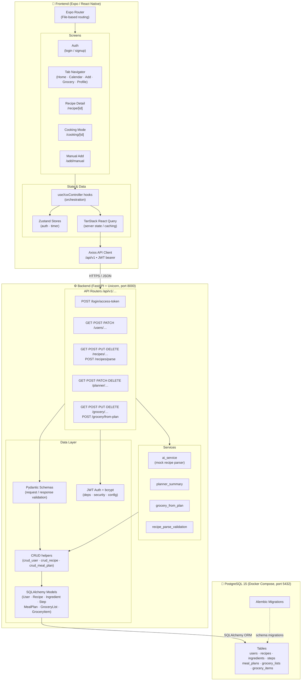

# SimpleChef Architecture

```mermaid
graph TB
    subgraph Client["📱 Frontend (Expo / React Native)"]
        direction TB
        Router["Expo Router\n(File-based routing)"]
        subgraph Screens["Screens"]
            Auth["Auth\n(login / signup)"]
            Tabs["Tab Navigator\n(Home · Calendar · Add · Grocery · Profile)"]
            Recipe["Recipe Detail\n/recipe/[id]"]
            Cooking["Cooking Mode\n/cooking/[id]"]
            Manual["Manual Add\n/add/manual"]
        end
        subgraph State["State & Data"]
            Zustand["Zustand Stores\n(auth · timer)"]
            ReactQuery["TanStack React Query\n(server state / caching)"]
            Controllers["useXxxController hooks\n(orchestration)"]
        end
        API_Client["Axios API Client\n/api/v1  •  JWT bearer"]
    end

    subgraph Backend["⚙️ Backend (FastAPI + Uvicorn, port 8000)"]
        direction TB
        subgraph Routes["API Routers  /api/v1/…"]
            R_Login["POST /login/access-token"]
            R_Users["GET·POST·PATCH /users/…"]
            R_Recipes["GET·POST·PUT·DELETE /recipes/…\nPOST /recipes/parse"]
            R_Planner["GET·POST·PATCH·DELETE /planner/…"]
            R_Grocery["GET·POST·PUT·DELETE /grocery/…\nPOST /grocery/from-plan"]
        end
        subgraph Services["Services"]
            AI["ai_service\n(mock recipe parser)"]
            PlannerSvc["planner_summary"]
            GrocerySvc["grocery_from_plan"]
            ParseVal["recipe_parse_validation"]
        end
        subgraph Data["Data Layer"]
            CRUD["CRUD helpers\n(crud_user · crud_recipe · crud_meal_plan)"]
            Models["SQLAlchemy Models\n(User · Recipe · Ingredient · Step\n MealPlan · GroceryList · GroceryItem)"]
            Schemas["Pydantic Schemas\n(request / response validation)"]
            Security["JWT Auth + bcrypt\n(deps · security · config)"]
        end
    end

    subgraph DB["🐘 PostgreSQL 15 (Docker Compose, port 5432)"]
        Tables["Tables\nusers · recipes · ingredients · steps\nmeal_plans · grocery_lists · grocery_items"]
        Alembic["Alembic Migrations"]
    end

    Router --> Screens
    Screens --> Controllers
    Controllers --> ReactQuery
    Controllers --> Zustand
    ReactQuery --> API_Client
    API_Client -->|"HTTPS / JSON"| Routes
    Routes --> Services
    Routes --> Security
    Routes --> Schemas
    Services --> CRUD
    Schemas --> CRUD
    CRUD --> Models
    Models -->|"SQLAlchemy ORM"| Tables
    Alembic -.->|"schema migrations"| Tables
```
