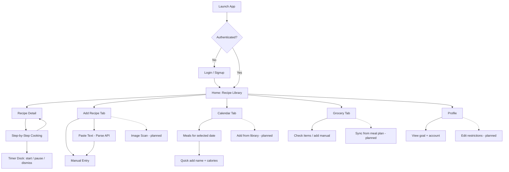
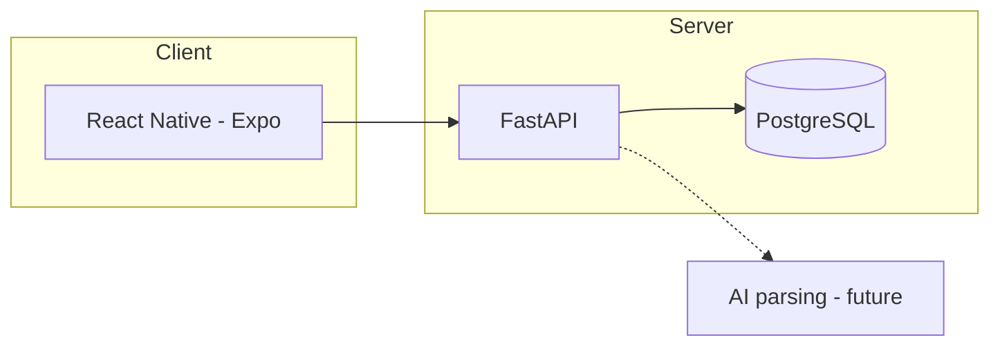
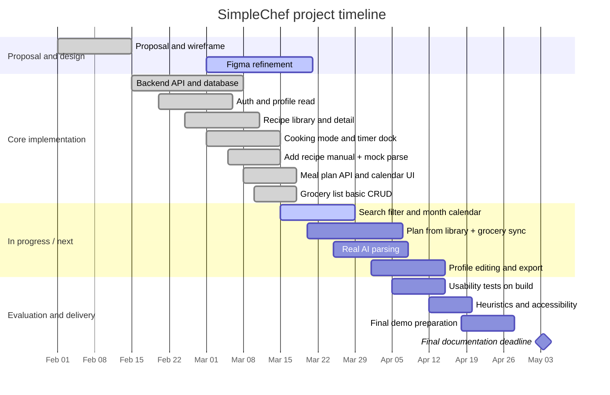

# SimpleChef Progress Report (Rough Draft)

**Note:** The canonical IEEE LaTeX submission is a **single file**: `Latex/main.tex` (see `Latex/README.md`). This Markdown draft may be out of date; align narrative with `main.tex` and repository docs under `docs/`.

**Group Name:** [Your Group Name]  
**Date:** March 22, 2026  
**Course:** Human-Computer Interaction  
**Instructor:** [Instructor Name]

---

## 1. Project Overview

SimpleChef is a mobile-first cooking assistant application designed to reduce friction across the entire cooking process---from discovering a recipe to meal planning and grocery shopping. The tagline *Your calm kitchen companion* captures the app’s goal: to serve as a capable, calm companion that streamlines daily cooking tasks.

As described in our project proposal, existing cooking applications often fragment the experience. Users may browse recipes in one app, track calories in another, and maintain grocery lists in notes or paper. Recipe instructions are frequently buried in long blocks of text, and timer management during cooking can force users to switch contexts. SimpleChef addresses these pain points by aiming to unify recipe discovery, step-by-step cooking mode with integrated timers, meal planning with calorie awareness, and grocery list support into a single, cohesive interface. The design applies Human-Computer Interaction (HCI) principles such as progressive disclosure, clarity over clutter, and smart defaults with full user control.

### Objectives (aligned with the proposal)

- **Unify the cooking workflow** across recipe browsing, cooking mode, planning, and groceries with consistent navigation and data flow.
- **Optimize the step-by-step cooking experience** so that each step is scannable during active cooking, with integrated timers and (in the full design) mise en place aligned to steps.
- **Implement intelligent timer management** via a timer dock that surfaces active timers and keeps users in the cooking context.
- **Automate grocery list generation** from planned meals (with deduplication, categories, editing, and export)---planned as a later integration milestone.
- **Reduce recipe input friction** through multiple input paths---manual entry plus AI-assisted parsing from text (with verification before saving); image and video import are planned.
- **Support meal planning and calorie goals** by assigning meals to days and relating plans to profile goals; dietary filtering and richer statistics are planned extensions.
- **Validate through iteration** using usability feedback and refinement of flows and visual design.

### Tools and technology (as proposed)

- **Frontend:** React Native (Expo) for cross-platform mobile development.
- **Backend:** FastAPI (Python) with PostgreSQL.
- **Design:** Figma for wireframes and high-fidelity prototyping.
- **AI/ML:** Intended for recipe parsing from text, image, or video; the current build uses a structured placeholder parser to exercise the end-to-end flow.

---

## 2. Project Progress Overview

As of March 22, 2026, the team has moved from specification into **working vertical slices** of the application: a deployed-style local stack (Expo client, FastAPI API, PostgreSQL) supports authenticated use of the main tabs and core screens described in the proposal.

### Completed milestones and components

- **Project proposal and design specification:** Scope, problem statement, proposed UI (five-tab layout: Home, Calendar, Add, Grocery, Profile), wireframe, and timeline documented.
- **Backend foundation:** FastAPI application with database models and migrations; user authentication; CRUD-style endpoints for recipes, meal plans, and grocery items.
- **User authentication:** Login and signup on the client; JWT-backed access to protected routes (e.g., creating recipes, user-specific grocery lists).
- **Recipe library (Home):** Scrollable list of recipe cards with navigation to recipe detail; optional hero imagery and metadata (e.g., prep time, difficulty) when present on records.
- **Recipe detail:** Scrollable view with image (when available), summary stats, full ingredient list, and full instruction list; primary call to action **Begin Cooking** enters step-by-step mode.
- **Step-by-step cooking mode:** One step shown at a time with previous/next controls, overall progress indication, and **per-step timer triggers** where `timer_seconds` is set. A **timer dock** displays active timers, sorted by least time remaining, with play/pause and dismiss---matching the proposal’s intent to avoid leaving the cooking context for timing.
- **Add recipe:** **Manual entry** screen with dynamic ingredient and step rows (including optional timer duration per step). **Paste text / AI parse** opens a modal, sends text to the backend `/recipes/parse` endpoint, and pre-fills the manual form for user review before save (verification/edit flow as proposed). **Scan image** is present in the UI as a disabled placeholder (*Coming Soon*).
- **Meal planner (Calendar tab):** For a selected date, the app loads and displays planned entries from the API and supports **quick add** of a custom food name and calorie value. The backend model supports linking a meal to a `recipe_id`; the current UI flow emphasizes quick-add rather than picking recipes from the library.
- **Grocery list:** User-specific list with items grouped by category in a sectioned list, check-off state persisted via the API, and **manual add** of items. Categories appear as returned/stored (e.g., default *Uncategorized* for manually added lines).
- **Profile:** Displays account name, email, and calorie goal from the server. The data model includes fields such as dietary restrictions and preferences for future profile editing and filtering.

### Gaps relative to the proposed UI (honest status)

- **Home:** Search and filter affordances appear in the header but are **not yet wired** to query parameters or client-side filtering.
- **Cooking mode:** The proposal’s per-step **mise en place** (ingredients tied to each step) is **not yet modeled or shown**; the implementation focuses the screen on the current instruction and timers. Ingredient--step association remains a design/data-model target.
- **Calendar:** The proposal described a **monthly calendar with dots** and a bottom panel for adding meals from the library; the current screen is a **date-focused list** with quick-add, without the full month grid or recipe-picker flow.
- **Grocery list:** **Auto-population from the meal plan** (aggregation, deduplication) is **not yet implemented** in the API or client; the list is manual plus whatever items exist on the user’s list through the current endpoints.
- **AI parsing:** The service is a **mock structured parser** (deterministic placeholder) rather than a production LLM or vision pipeline; it exists to validate UX for parse-then-edit.
- **Profile:** No in-app editing of dietary restrictions, goals, or friends/sharing yet, though the backend schema anticipates some of these fields.

This state is broadly consistent with our proposal’s phased plan: **Weeks 1--4 (through the progress report)** emphasized core prototype development (library, cooking mode with timer dock, meal planner groundwork), while **grocery automation**, richer **recipe input** (full AI, image/video), and **profile/settings** were slated for the following weeks---though parts of Add Recipe and Grocery have been started early.

---

## 3. Ongoing Challenges and Design Difficulties

### Challenge 1: Closing the loop between meal plans, recipes, and groceries

**Issue:** The proposal promises a grocery list that reflects planned meals. Without server-side aggregation from `MealPlan` and `Recipe` ingredients, users still mentally bridge planning and shopping.

**Approach:** We are defining aggregation rules (servings scaling, deduplication, unit handling) before exposing a “sync from plan” action. The UI will keep **full edit control** after generation, consistent with our usability goals.

### Challenge 2: Search, filter, and dietary personalization

**Issue:** The proposal calls for filtering by dietary restrictions, cook time, and difficulty. The profile model can store restrictions, but the library does not yet apply them, and search icons are placeholders.

**Approach:** Implement query parameters or client filters on the recipe list, then tie optional defaults to `users.me` preferences. We will prioritize **high-signal filters** (e.g., dietary tags) that reduce choice overload on the Home screen.

### Challenge 3: Mise en place and step granularity

**Issue:** Showing every ingredient on every step can overwhelm users; hiding linkage entirely (current MVP) does not match the proposal’s guided cooking story.

**Approach:** Extend the recipe schema to associate ingredients with steps (or heuristics from parsing), then surface a **short checklist** only for the active step. Usability tests will compare cognitive load and error rates vs. the full-ingredient list on the detail screen only.

### Challenge 4: Realistic AI parsing and trust

**Issue:** Users must trust imported recipes. A mock parser risks misleading test users about accuracy.

**Approach:** Replace the mock with a real text parser behind the same **verify-and-edit** screen, keep image/video import behind clear *beta* or *coming soon* states, and measure correction time and satisfaction in testing.

### Challenge 5: Calendar information density

**Issue:** A month grid with multiple meals per day can clutter quickly; a list-only view is simpler but loses the “at a glance” planning metaphor from the proposal.

**Approach:** Prototype a **month grid with indicators** plus the existing day detail pattern; user testing will inform whether we default to week or month and how to expose **add from library** without extra taps.

---

## 4. Implementation Evidence (Initial Demo)

Provide screenshots or screen recordings from the **running Expo app** connected to the local (or staged) API, with captions that map each figure to the proposal sections. Replace bracketed notes with your own captures.

### Figure 1: Authentication

*Caption: Login and signup screens demonstrating secure access before personalized lists and meal plans.*

[Insert screenshot: login / signup]

### Figure 2: Recipe library (Home)

*Caption: Recipe list with cards and header actions; illustrates the Recipe Library tab from the proposed bottom navigation.*

[Insert screenshot: Home / recipe list]

### Figure 3: Recipe detail and entry into cooking mode

*Caption: Recipe detail with ingredients, steps, and the prominent **Begin Cooking** control described in the proposal.*

[Insert screenshot: recipe detail]

### Figure 4: Step-by-step cooking mode and timer dock

*Caption: Single-step cooking view with progress and the timer dock showing an active step timer; illustrates integrated timer management without leaving the flow.*

[Insert screenshot: cooking mode with TimerDock]

### Figure 5: Add Recipe---manual and AI-assisted paths

*Caption: Add tab with manual entry and paste-text parsing; after parse, the manual form opens pre-filled for user verification before save.*

[Insert screenshot: Add tab; optional second screenshot: manual form with parsed data]

### Figure 6: Meal planner and grocery list

*Caption: Meal planner for a selected date with quick-add entries; grocery list grouped by category with check-off and manual add.*

[Insert screenshot: calendar/meal planner; grocery list]

### Figure 7: Profile

*Caption: Profile showing user identity and calorie goal; future iterations will add editing for restrictions and related settings.*

[Insert screenshot: profile]

**Optional:** Repository link or short demo video URL: [e.g., private unlisted video or GitHub]

---

## 5. Future Work and To-Do List

Grouped to match the proposal’s later phases and remaining gaps.

### Near term (complete core proposal slice by late March--April)

| Task | Notes |
|------|--------|
| Wire Home search and filter | Query or client filter; align with recipe schema (tags, difficulty, time). |
| Month-view calendar + add from library | Use `recipe_id` on `MealPlan`; bottom sheet pattern from proposal. |
| Grocery list generation from plan | Server aggregation + client refresh; dedupe and editable categories. |
| Profile editing | Calorie goal and dietary restrictions; drive optional recipe filtering. |
| Replace mock AI parser | Same UX; improve extraction quality and error handling. |

### Mid term (proposal Weeks 5--7 and polish)

| Task | Notes |
|------|--------|
| Image (and later video) import | OCR / model pipeline; clear loading and failure states. |
| Mise en place per step | Data model + cooking UI checklist. |
| Export / share grocery list | Share sheet to notes or messaging as proposed. |
| Optional statistics | Trends over time tied to meal logs and goals. |
| Friends / sharing | If retained from proposal, API and UI for social features. |

### Course deliverables

| Task | Notes |
|------|--------|
| Usability testing on functional build | Tasks covering browse, cook with timers, plan, grocery. |
| Heuristic evaluation and accessibility pass | Contrast, touch targets, cooking-context legibility. |
| Final demo and documentation | Live demonstration, design rationale, and user analysis per syllabus. |

---

## 6. Project Plan and Concept (Sketch / Workflow)

### Figure 8: User flow (current implementation emphasis)

*Caption: Primary journeys supported in the current build: authenticate, browse recipes, view detail, cook with timers, add recipes (manual or parse-then-edit), log quick meals for a date, and maintain a grocery list. Dashed lines indicate planned or partial flows.*

### Figure 9: System context (high level)

*Caption: Expo client communicates with FastAPI over HTTP; PostgreSQL persists users, recipes, meal plans, and grocery data. Optional future AI services connect at the API layer for parsing.*

---

## 7. Project Progress Timeline (Gantt Chart)

The chart below aligns with the proposal’s milestones while reflecting **actual progress** toward a functional prototype (not design-only). Adjust dates to match your group’s term calendar if needed.

**Timeline notes**

- **Progress report due:** March 26, 2026 (per course assignment).
- **Proposal final documentation** referenced **May 3** for the final project report; keep internal milestones consistent with the syllabus.
- **Risk:** Parser quality and meal--grocery integration depend on schema decisions; parallelize API work with UI mocks to avoid blocking usability tests.

---

## Documentation References

[1] Preece, J., Rogers, Y., & Sharp, H. (2015). *Interaction Design: Beyond Human-Computer Interaction*. 4th ed. Wiley. (Course textbook)

[2] Nielsen, J. (1994). “Heuristic Evaluation.” In Nielsen, J., & Mack, R. L. (Eds.), *Usability Inspection Methods*. John Wiley & Sons.

[3] Hartson, R., & Pyla, P. (2012). *The UX Book: Process and Guidelines for Ensuring a Quality User Experience*. Morgan Kaufmann.

[4] Figma. “Best Practices for Prototyping.” https://help.figma.com/hc/en-us/categories/360002051614-Design. Accessed March 2026.

[5] World Wide Web Consortium (W3C). “Web Content Accessibility Guidelines (WCAG) 2.1.” https://www.w3.org/TR/WCAG21/. Accessed March 2026.

---

*When converting to IEEE two-column PDF, map each numbered section to the course template; replace all bracketed placeholders (group name, instructor, figures, optional links) before submission.*
