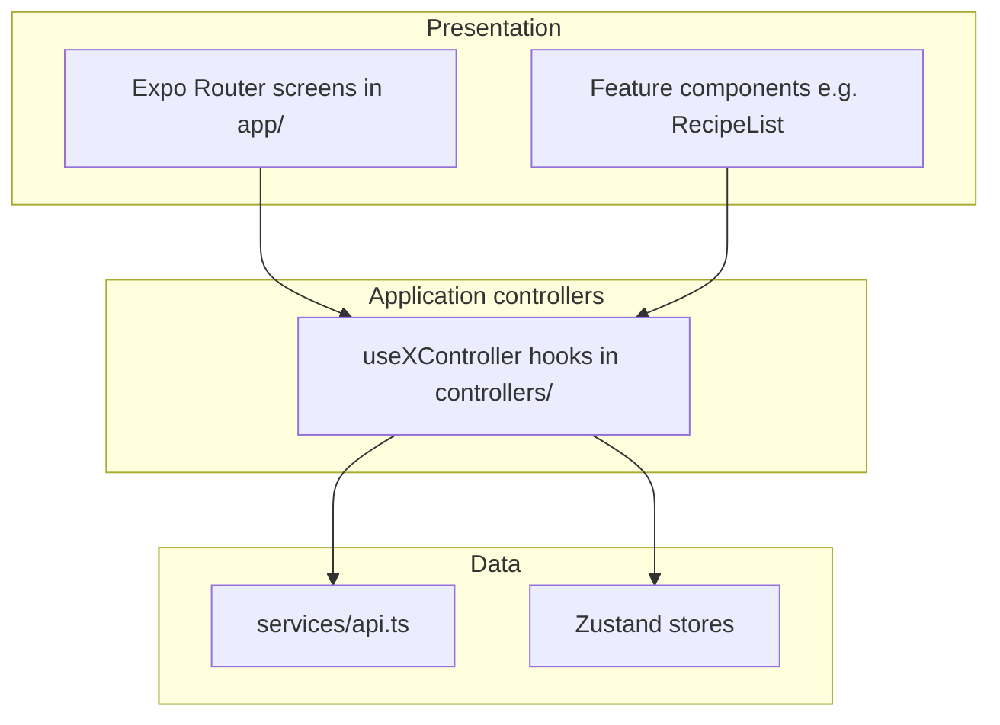

# SimpleChef - System Architecture

## 1. Architectural Patterns
The system follows a **Client-Server** architecture with a **Layered** approach to ensure high cohesion and low coupling.

- **Frontend:** React Native (Expo) for cross-platform mobile/web support.
- **Backend:** Python (FastAPI) for high performance and AI integration.
- **Database:** PostgreSQL for structured relational data.

## 2. Tech Stack

### Frontend (Client)
- **Framework:** React Native with Expo (Managed Workflow).
- **Language:** TypeScript.
- **State Management:** React Query (Server state) + Zustand or Context API (Client state/Timers).
- **UI Component Library:** React Native Paper or Tamagui for responsive design.
- **Navigation:** Expo Router / React Navigation.

### Backend (Server)
- **Framework:** FastAPI (Python).
- **ORM:** SQLAlchemy or Prisma (Python client) / SQLModel.
- **Authentication:** OAuth2 with JWT (JSON Web Tokens).
- **AI Integration:** OpenAI API / LangChain for recipe parsing.

### Infrastructure & DevOps
- **Containerization:** Docker for backend and database.
- **Storage:** AWS S3 (or compatible) for image/video storage.

## 3. System Modules (Separation of Concerns)

### 3.1. Frontend Modules
- **`app/`**: Route handlers (Expo Router).
- **`components/`**: Reusable UI components (Atoms, Molecules).
- **`features/`**: Feature-specific logic (Cooking, Planning, Recipes).
- **`services/`**: API clients and adapters.
- **`store/`**: Global state management.
- **`controllers/`**: Application-layer hooks (`use*Controller`) — load/save orchestration, validation, navigation callbacks; routes and feature views consume these instead of calling `services/api` directly.
- **`types/`**: DTO-style TypeScript types aligned with FastAPI responses.

### 3.2. Backend Modules
- **`api/`**: Route controllers.
- **`core/`**: Config, Security, Database connection.
- **`models/`**: Database schemas (SQLAlchemy/Pydantic).
- **`services/`**: Business logic.
    - `AuthService`: User management.
    - `RecipeService`: CRUD and AI parsing logic.
    - `PlannerService`: Calendar and Meal tracking.
    - `ShoppingService`: List generation and management.
- **`schemas/`**: Pydantic models for request/response validation.

## 4. Data Flow
1.  **Recipe Creation:** User uploads image -> Backend receives -> AI Service parses -> Returns draft -> User verifies -> Backend saves to DB.
2.  **Meal Planning:** User adds recipe to date -> PlannerService updates `DailyPlan` -> Triggers `ShoppingService` to update `GroceryList`.
3.  **Cooking:** Frontend manages Timer state locally (persisted if app backgrounded) -> Updates progress to Backend.

## 5. ERD (Entity Relationship Diagram) Concept
- **User** (1) <--> (N) **Recipe**
- **User** (1) <--> (N) **MealPlan**
- **MealPlan** (1) <--> (N) **Recipe**
- **Recipe** (1) <--> (N) **Ingredient**
- **User** (1) <--> (1) **GroceryList**
- **GroceryList** (1) <--> (N) **GroceryItem**

## 6. API authorization (ownership pattern)

All mutating endpoints must verify the authenticated user owns the resource (or the resource is scoped to them via a parent row).

- **Recipes**
  - `GET /recipes/` returns recipes where `created_by_id == current_user.id` **or** `is_public` is true.
  - `GET /recipes/{id}` returns **404** if the recipe is neither owned by the user nor public (avoid existence leaks).
  - `POST /recipes/` sets `created_by_id` to the current user; optional `is_public` on the body is honored.
  - `PUT` / `DELETE /recipes/{id}` require `created_by_id == current_user.id`; otherwise **403**.
  - Legacy rows with `created_by_id` null are migrated to `is_public = true` so existing demo data stays visible.

- **Grocery items**
  - `PUT /grocery/items/{id}` loads the item by joining `GroceryItem` → `GroceryList` and filtering `GroceryList.user_id == current_user.id`. Other users get **404** (same shape as “not found”).

**Pattern for new endpoints:** join from the row being updated/deleted up to `user_id` (or equivalent) and compare to `current_user.id` before applying changes. Prefer **404** over **403** for cross-tenant id guesses when the UX should not reveal whether a row exists.

## 7. Cooking data model (mise en place)

- `Ingredient` may reference `Step` via nullable `step_id` (FK). Clients send `step_order_index` on create/update; the API resolves it to `step_id` after steps are persisted.
- **Display rules (app):** ingredients with no `step_id` appear in mise on **step 1 only** (global prep). Ingredients linked to the current step appear for that step.

## 8. Grocery merge from meal plan

- `POST /grocery/from-plan` loads `MealPlan` rows for the user in `[start_date, end_date]` with a `recipe_id`, expands each recipe’s ingredients, aggregates by normalized `(name, unit)`, sums quantities, assigns a default category from keywords, then **merges** into the user’s `GroceryItem` rows (add quantity when the key exists, else insert). Manual-only lines are untouched unless they share the same normalized key.

## 9. Frontend layering (Expo)

- **Presentation** (`app/`, `features/`): layout, Paper components, accessibility labels; no direct `recipeService` / `plannerService` calls in route files after the controller refactor.
- **Application** (`controllers/`): per-screen state, debouncing, modals, and async actions.
- **Data** (`services/api.ts`, `store/`): HTTP, auth header, 401 handling; global token and timers.

**Documentation links**

- UI / Figma single source: [FIGMA_UI_SYSTEM_REQUIREMENTS.md](./FIGMA_UI_SYSTEM_REQUIREMENTS.md)
- SRS/proposal ↔ API matrix: [REQUIREMENTS_TRACEABILITY.md](./REQUIREMENTS_TRACEABILITY.md)
- Backend maintainability backlog (document-only): [BACKEND_REFINEMENT_NOTES.md](./BACKEND_REFINEMENT_NOTES.md)

## 10. Known backend improvements

See [BACKEND_REFINEMENT_NOTES.md](./BACKEND_REFINEMENT_NOTES.md) for suggested refactors (service extraction, test gaps, validation boundaries) tracked without blocking feature work.
